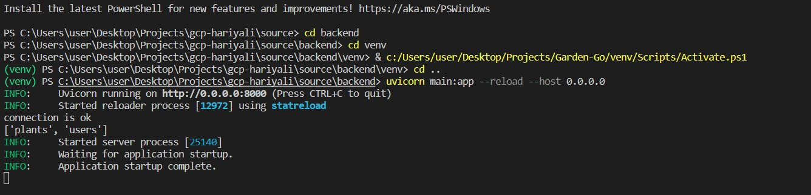

# For submission of R² Data Labs Responsible Growth Hack

# Hariyali

Remember the craze, when the Pokemon Go first launched for our mobiles. We spend our days all around catching pokemons and earning points. Keeping the craze alive we launch our all new Hariyali where instead of catching pokemons we need to capture new plant species ( which you do by planting them). The more you plant the more poi\nts you get. Let the plantation drive begins!! .

## Features

-**Plantation Drive:** Capture yourself with the plant you have just planted and get points based on species and whether you have planted a new species or not, it has an integrated face authentication that authenticates your face as well, so that we know it's you planting it.

-**Species recognition:** Not sure what's the plant species name you are going to plant,  no worries check it on our app

- **RecycleTeller:**   Came across some garbage while on your little discover tour and cannot identify whether this garbage comes under recyclable or non-recyclable check it here and extend your little help in saving the environment 

- **Leaderboard:** Check your rating among all the users and find whether you stand for rewards or not

## Technology stack

- Backend: FastAPI
- Frontend: Flutter
- Running on: Google Cloud App Service
- Media Storage: Google Cloud SQL 
- Database: Google Cloud Storage
- Deployment : GitHub Actions
- APIs: Plant.id, Azure Cognitive Services, Google Cloud Vertex AI

## Note
Since it is the submission for the Google hackathon, all the keys are exposed so that one could smoothly run the code if needed. 

## How to run the code.
1. Unzip the folder.
2. Open the linux terminal inside the backend folder.
3. Run the following commands as per the ss below.

]
